# Stella Orbit Track

Full-stack satellite tracking platform. Fetches TLE (Two-Line Element) data from CelesTrak, performs SGP4 orbital propagation, and visualizes satellite positions on an interactive map with real-time updates.

---

## Table of Contents

- [Tech Stack](#tech-stack)
- [System Architecture](#system-architecture)
- [Backend Architecture](#backend-architecture)
- [Frontend Architecture](#frontend-architecture)
- [Authentication Flow](#authentication-flow)
- [TLE Sync and Propagation Pipeline](#tle-sync-and-propagation-pipeline)
- [Client-Side Pagination Architecture](#client-side-pagination-architecture)
- [API Endpoints](#api-endpoints)
- [Database Schema](#database-schema)
- [Getting Started](#getting-started)
- [Project Structure](#project-structure)

---

## Tech Stack

### Backend

| Category                | Technology                                       |
| ----------------------- | ------------------------------------------------ |
| Framework               | FastAPI (async)                                  |
| ORM                     | SQLModel (SQLAlchemy + Pydantic)                 |
| Database                | SQLite (aiosqlite async driver)                  |
| Cache / Token Blacklist | Redis                                            |
| Auth                    | PyJWT, passlib (pbkdf2_sha256), pyotp (TOTP/MFA) |
| Email                   | fastapi-mail + Jinja2 templates                  |
| HTTP Client             | httpx (CelesTrak fetch, OAuth)                   |
| Orbital Propagation     | sgp4                                             |
| Scheduler               | Native asyncio tasks                             |
| API Docs                | Scalar UI                                        |

### Frontend

| Category              | Technology                                   |
| --------------------- | -------------------------------------------- |
| Framework             | React 19                                     |
| Build                 | Vite 6                                       |
| Language              | JSX + TypeScript (mixed, TS for IDE support) |
| Routing               | react-router-dom 7                           |
| State / Data Fetching | TanStack React Query 5                       |
| Forms                 | react-hook-form 7                            |
| Styling               | Tailwind CSS v4                              |
| UI Components         | shadcn/ui (Radix primitives)                 |
| Charts                | Recharts                                     |
| Map                   | Leaflet + react-leaflet                      |
| Satellite Math        | satellite.js                                 |

---

## System Architecture

```
+---------------------------+         +--------------------------+
|        Frontend           |         |        Backend           |
|       (React/Vite)        |  HTTP   |       (FastAPI)          |
|                           +-------->+                          |
|  React Query              |  JSON   |  API Layer (Routers)     |
|  react-router-dom         |<--------+  Service Layer           |
|  Leaflet Map              |         |  Database Layer          |
|  satellite.js (SGP4)      |         |  Worker (Scheduler)      |
+---------------------------+         +-------+--+------+--------+
                                              |  |      |
                                              v  v      v
                                         SQLite Redis  CelesTrak
                                                       (External)
```

<details>
<summary>Mermaid</summary>

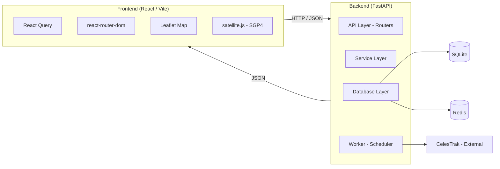

</details>

### Request Flow

```
Browser
  |
  v
React App (SPA)
  |-- react-router-dom (client routing)
  |-- React Query (cache + fetch)
  |-- apiFetch() wrapper (Authorization header injection)
  |
  v
FastAPI Backend
  |-- CORS Middleware
  |-- Exception Handlers (HTTPException, ValidationError)
  |-- Router (master_router -> 5 sub-routers)
  |     |-- Dependency Injection (get_session, get_*_service)
  |     v
  |-- Service Layer (business logic)
  |     |-- BaseService (generic CRUD)
  |     |-- Domain Services (Satellite, TLE, User, MFA, Propagation, OAuth)
  |     v
  |-- Database Layer
  |     |-- SQLModel (async session)
  |     |-- Redis (JWT blacklist)
  |     v
  |-- Worker Layer
        |-- Celestrak sync (hourly)
        |-- TLE refresh (every 15 min)
```

<summary>Mermaid</summary>

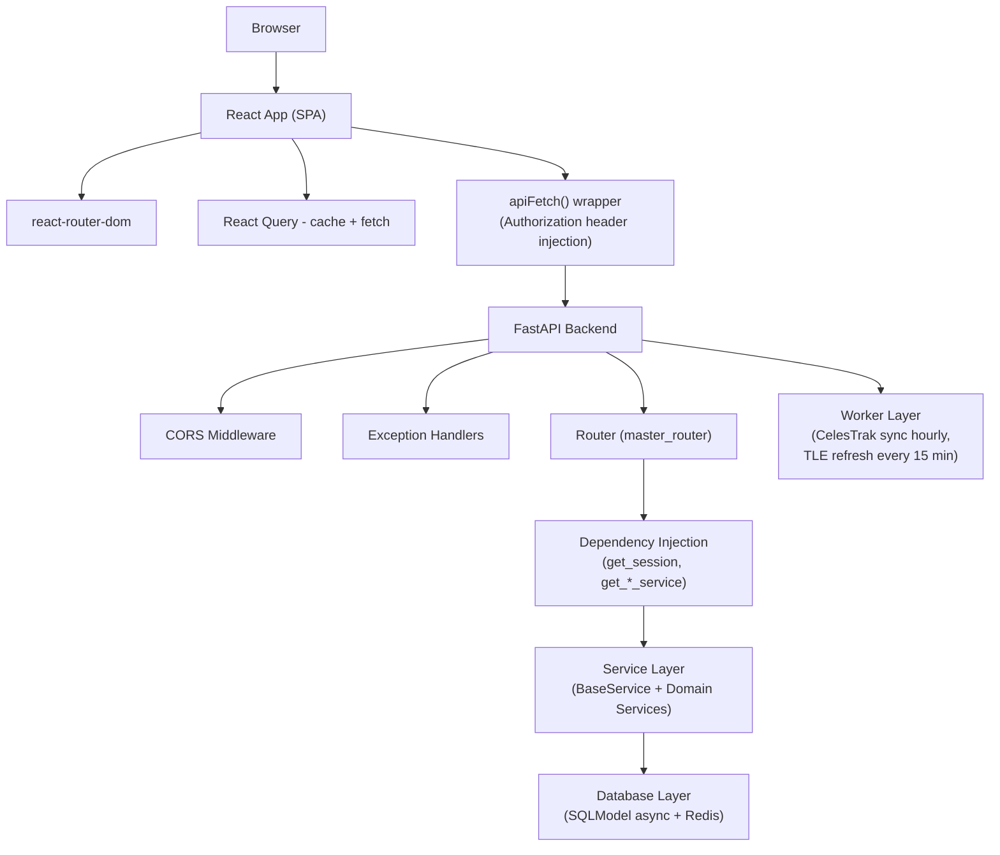

---

## Backend Architecture

### Layered Architecture

```
+---------------------------------------------------------------+
|                     FastAPI Application                        |
|  main.py -- lifespan, CORS, exception handlers                |
+------------------+--------------------------------------------+
|   API Layer      |  api/router.py (master_router)              |
|                  |  api/routers/satellite.py                   |
|                  |  api/routers/user.py                        |
|                  |  api/routers/oauth.py                       |
|                  |  api/routers/tle.py                         |
|                  |  api/routers/propagation.py                 |
|                  |  api/dependencies.py                        |
+------------------+--------------------------------------------+
|   Service Layer  |  services/base.py (BaseService -- CRUD)     |
|                  |  services/satellite.py                      |
|                  |  services/tle.py                            |
|                  |  services/user.py                           |
|                  |  services/mfa.py                            |
|                  |  services/notification.py                   |
|                  |  services/propagatecache.py                 |
|                  |  services/oauth/ (GitHub, Google)            |
+------------------+--------------------------------------------+
|   Core Layer     |  core/security.py (oauth2_scheme)            |
|                  |  utils.py (JWT encode/decode, URL tokens)   |
|                  |  config.py (pydantic-settings)              |
|                  |  schemas.py (Pydantic DTOs)                 |
+------------------+--------------------------------------------+
|   Database Layer |  database/models.py (SQLModel)              |
|                  |  database/session.py (async engine)         |
|                  |  database/redis.py (JWT blacklist)          |
+------------------+--------------------------------------------+
|   Worker Layer   |  worker/tasks.py (asyncio scheduler)        |
|                  |  CelesTrak sync + TLE refresh               |
+------------------+--------------------------------------------+
```

<summary>Mermaid</summary>

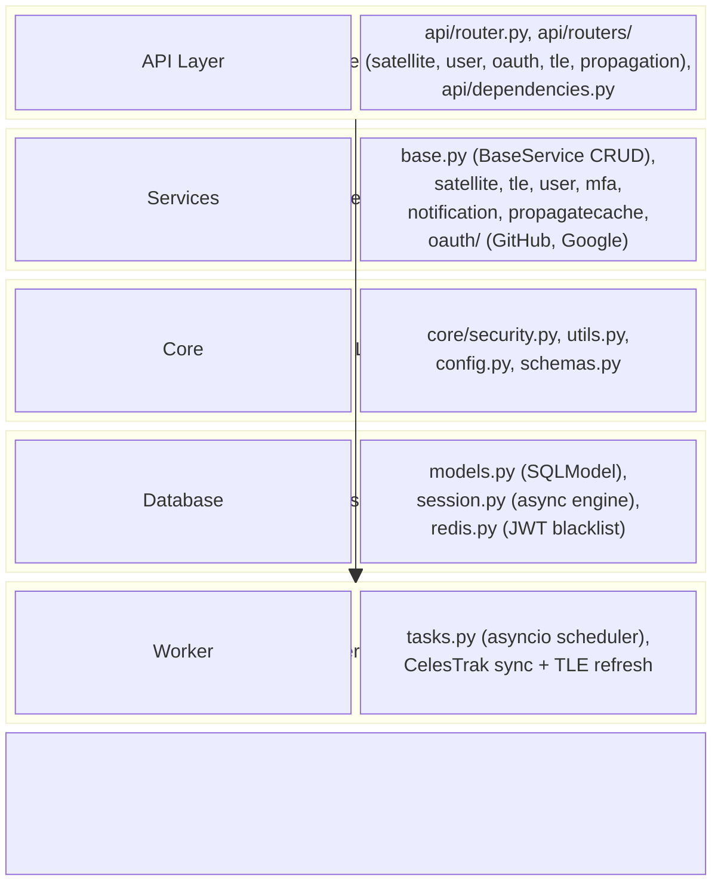

### Dependency Injection Tree

```
get_session (AsyncSession)
  +-- get_satellite_service  -> SatelliteService
  +-- get_tle_service        -> TLEService
  +-- get_propagation_service -> PropagationService
  +-- get_user_service       -> UserService (+ BackgroundTasks)
  +-- get_mfa_service        -> MFAService
  +-- get_oauth_service      -> OauthService

oauth2_scheme (Bearer)
  +-- get_access_token -> decode JWT + check Redis blacklist
        +-- get_current_user -> fetch User from DB
```

<summary>Mermaid</summary>

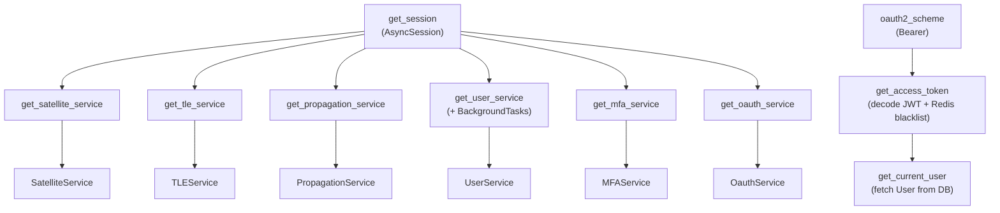

### Service Layer Design

`BaseService` provides generic CRUD operations (`_get`, `_get_by`, `_list`, `_add`, `_update`, `_delete`) on any SQLModel entity. Domain services inherit and extend with business logic:

- **SatelliteService** -- CRUD + upsert by `norad_id`
- **TLEService** -- CRUD + orbital element parsing from line2 (inclination, RAAN, eccentricity, argument of perigee, mean anomaly, mean motion, semi-major axis)
- **UserService** -- registration, email verification, password hashing, JWT issuance, password reset
- **MFAService** -- TOTP secret generation, QR URI, code verification via pyotp
- **PropagationService** -- SGP4 propagation (ECI vectors + geodetic conversion), flyover prediction (rise/peak/set scan)
- **NotificationService** -- email dispatch via fastapi-mail with Jinja2 templates
- **OauthService** -- provider registry (GitHub/Google), code exchange, user linking by email

### Worker / Scheduler

Two background tasks run inside FastAPI lifespan (no external Celery required):

| Task                             | Default Interval | Description                                                                       |
| -------------------------------- | ---------------- | --------------------------------------------------------------------------------- |
| `sync_satellites_from_celestrak` | 3600s (1h)       | Fetches 3LE from CelesTrak, parses into Satellite records, upserts by `norad_id`  |
| `refresh_tle_history`            | 900s (15min)     | For each satellite with line data, parses orbital elements and upserts TLE record |

---

## Frontend Architecture

### Component Architecture

```
App (BrowserRouter)
  +-- QueryClientProvider (React Query, staleTime: 60s)
  +-- Routes
        +-- ProtectedRoute (checks auth via /user/me)
        |     +-- AppLayout (CSS Grid)
        |           +-- Header (UserAvatar, HeaderMenu, Logout)
        |           +-- Sidebar (Logo, MainNav)
        |           +-- <Outlet /> (page content)
        |                 +-- Dashboard
        |                 +-- Satellites (SatelliteTable + AddSatellite)
        |                 +-- Tles (TleTable)
        |                 +-- Tle detail (TleDetail + Leaflet map)
        |                 +-- Settings (UpdateSettingsForm)
        |                 +-- Account (UpdateUserDataForm, UpdatePasswordForm)
        +-- Login (LoginForm, OAuthLogin)
        +-- OAuthCallback
        +-- MFA verification
```

<details>
<summary>Mermaid</summary>

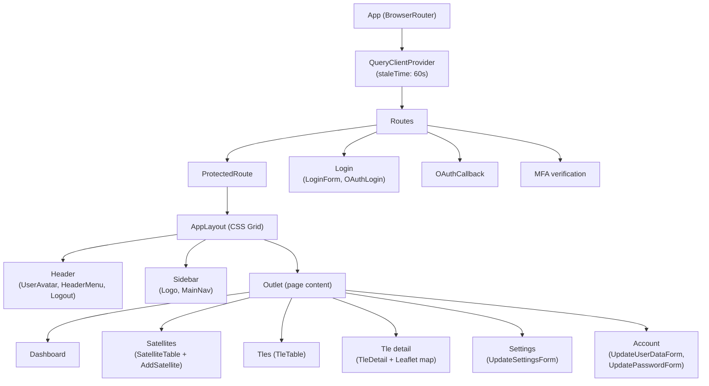

</details>

### Routing Table

| Path                  | Component                                  | Access    |
| --------------------- | ------------------------------------------ | --------- |
| `/`                   | Redirect to `/dashboard`                   | Protected |
| `/dashboard`          | Dashboard (charts + satellite cards)       | Protected |
| `/Satellites`         | SatelliteTable (paginated CRUD)            | Protected |
| `/TLEs`               | TleTable (paginated, filter by orbit type) | Protected |
| `/TLEs/:satellite_id` | TleDetail (orbital params + live map)      | Protected |
| `/Users`              | Users management                           | Protected |
| `/Settings`           | UpdateSettingsForm                         | Protected |
| `/account`            | User profile update                        | Protected |
| `/login`              | LoginForm + OAuthLogin                     | Public    |
| `/oauth/callback`     | OAuth token exchange                       | Public    |
| `/mfa`                | MFA TOTP verification                      | Public    |

### State Management

All server state is managed through **TanStack React Query**:

| Query Key                                        | Hook            | staleTime |
| ------------------------------------------------ | --------------- | --------- |
| `["user"]`                                       | `useUser`       | 5 min     |
| `["satellites", filter, sortBy, page, pageSize]` | `useSatellites` | 60s       |
| `["tles", filter, sortBy, page, pageSize]`       | `useTles`       | 60s       |
| `["tle", id]`                                    | `useTle`        | 60s       |
| `["settings"]`                                   | `useSettings`   | 60s       |

Mutations invalidate parent query keys on success. Both list hooks prefetch page +/- 1 for instant navigation.

No global state store (no Redux/Zustand). Auth token stored in `localStorage`, injected via `apiFetch` wrapper.

### API Service Layer

All API calls route through a centralized `apiFetch()` wrapper:

```
apiFetch(path, options)
  +-- Base URL from VITE_API_BASE_URL
  +-- Auto-injects Authorization: Bearer <token>
  +-- 401 -> clears token, redirects to /login
  +-- Non-OK -> throws Error(detail)
  +-- 204 -> returns null
```

### Feature Modules

Each feature is self-contained under `src/features/`:

```
features/
  +-- authentication/
  |     LoginForm, SignupForm, OAuthLogin,
  |     useLogin, useLogout, useUser, useSignup, useUpdateUser
  +-- satellite/
  |     SatelliteTable, SatelliteRow, SatelliteTableOperations,
  |     CreateSatelliteForm, SatelliteCard, SatelliteView,
  |     useSatellites, useCreateSatellite, useEditSatellite, useDeleteSatellite
  +-- tle/
  |     TleTable, TleRow, TleTableOperations, TleDetail,
  |     useTles, useTle
  +-- dashboard/
  |     Dashboard (Recharts: inclination, eccentricity, launch year,
  |     lifetime scatter, altitude distribution, averages)
  +-- settings/
        UpdateSettingsForm, useSettings, useUpdateSetting
```

### Reusable Component Patterns

- **Compound Components**: `Table` (Header, Body, Row, Footer), `Modal` (Open, Window), `Menusv1` (Toggle, List, Button)
- **URL-driven state**: `Filter` and `SortBy` write to search params; `usePaginationParams` reads them
- **Custom hooks**: `useOutsideClick`, `useLocalStorageState`, `useMoveBack`, `usePagination`, `useToast`

---

## Authentication Flow

### Standard Login

```
Client                          Backend
  |                               |
  |-- POST /user/signup --------->|  hash password, store user
  |                               |  send verification email
  |                               |
  |-- GET /user/verify?token= -->|  mark email_verified = true
  |                               |
  |-- POST /user/login --------->|  verify credentials
  |<-- { access_token } ---------|  (if MFA disabled: return JWT)
  |                               |
  |  OR                           |
  |<-- { mfa_required, token } --|  (if MFA enabled)
  |-- POST /user/verify_mfa ---->|  verify TOTP code
  |<-- { access_token } ---------|  issue JWT
  |                               |
  |-- Protected requests ------->|  Bearer token in header
  |                               |  decode JWT + check Redis blacklist
  |                               |
  |-- POST /user/logout -------->|  add JTI to Redis blacklist
```

<summary>Mermaid</summary>

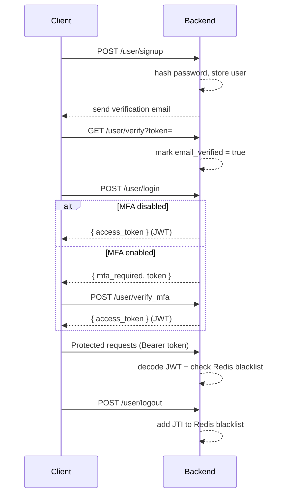

### OAuth Login (GitHub / Google)

```
Client                          Backend                    Provider
  |                               |                          |
  |-- GET /oauth/url?provider= ->|                          |
  |<-- { authorization_url } ----|                          |
  |                               |                          |
  |-- Browser redirect ---------------------------------->  |
  |                               |                          |
  |<-- Redirect with ?code= ------------------------------|
  |                               |                          |
  |-- GET /oauth/callback ------>|-- exchange code -------->|
  |                               |<-- access_token --------|
  |                               |-- fetch user profile --->|
  |                               |<-- email, name ----------|
  |                               |                          |
  |                               |  get_or_create user (link by email)
  |                               |  issue JWT
  |<-- Redirect /?token=JWT -----|
  |                               |
  |  OAuthCallback component:     |
  |  store token in localStorage  |
  |  navigate to /dashboard       |
```

<summary>Mermaid</summary>

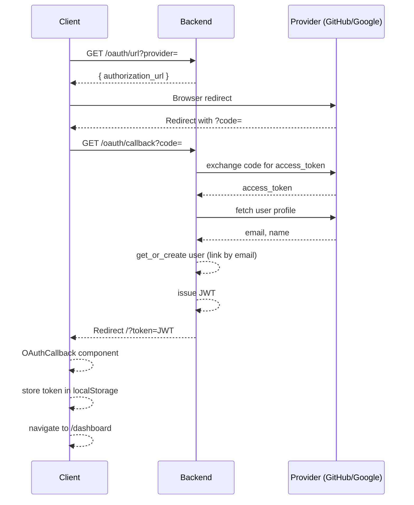

### MFA Setup

```
Client (authenticated)          Backend
  |                               |
  |-- GET /user/mfa_setup ------>|  generate TOTP secret
  |<-- { secret, uri } ----------|  store secret on user
  |                               |
  |  Display QR code (otpauth://) |
  |                               |
  |-- POST /user/enable_mfa ---->|  verify TOTP code
  |<-- { success } --------------|  MFA is now active
```

<summary>Mermaid</summary>

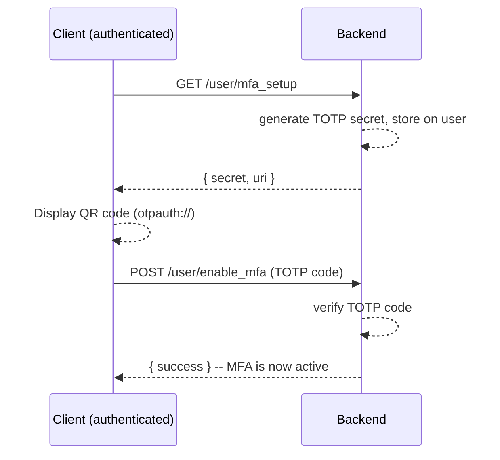

---

## TLE Sync and Propagation Pipeline

### Automated TLE Sync

```
                      +-- Every 1 hour --+
                      v                  |
              CelesTrak API              |
         (GET /?GROUP=&FORMAT=3le)       |
                      |                  |
                      v                  |
         Parse 3-Line Element Format     |
         (name, line1, line2)            |
                      |                  |
                      v                  |
         Upsert Satellite records        |
         (match by norad_id)             |
                      |                  |
        +-- Every 15 min --+             |
        v                  |             |
  Parse line2 orbital      |             |
  elements:                |             |
  - inclination            |             |
  - RAAN                   |             |
  - eccentricity           |             |
  - arg of perigee         |             |
  - mean anomaly           |             |
  - mean motion            |             |
  - semi-major axis        |             |
  (a = (GM*T^2/4pi^2)^1/3) |             |
        |                  |             |
        v                  |             |
  Upsert TLE records       |             |
  (one per satellite)      +-------------+
```

<summary>Mermaid</summary>

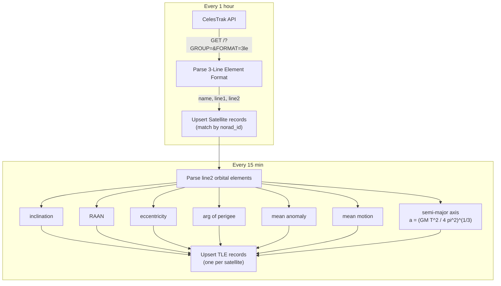

### Real-Time Propagation (On-Demand)

```
Client                          Backend
  |                               |
  |-- GET /propagation/          |
  |   position/:satelliteId ---->|  1. Fetch latest TLE for satellite
  |                               |  2. Initialize SGP4 propagator
  |                               |  3. Propagate to requested time
  |                               |  4. Get ECI position/velocity vectors
  |                               |  5. Convert to geodetic (lat/lon/alt)
  |<-- {                         |
  |      position: {x,y,z},     |
  |      velocity: {x,y,z},     |
  |      latitude, longitude,   |
  |      altitude, timestamp    |
  |    } -----------------------|
  |                               |
  |  Frontend: plot on Leaflet   |
  |  map with 5-second polling   |
```

<summary>Mermaid</summary>

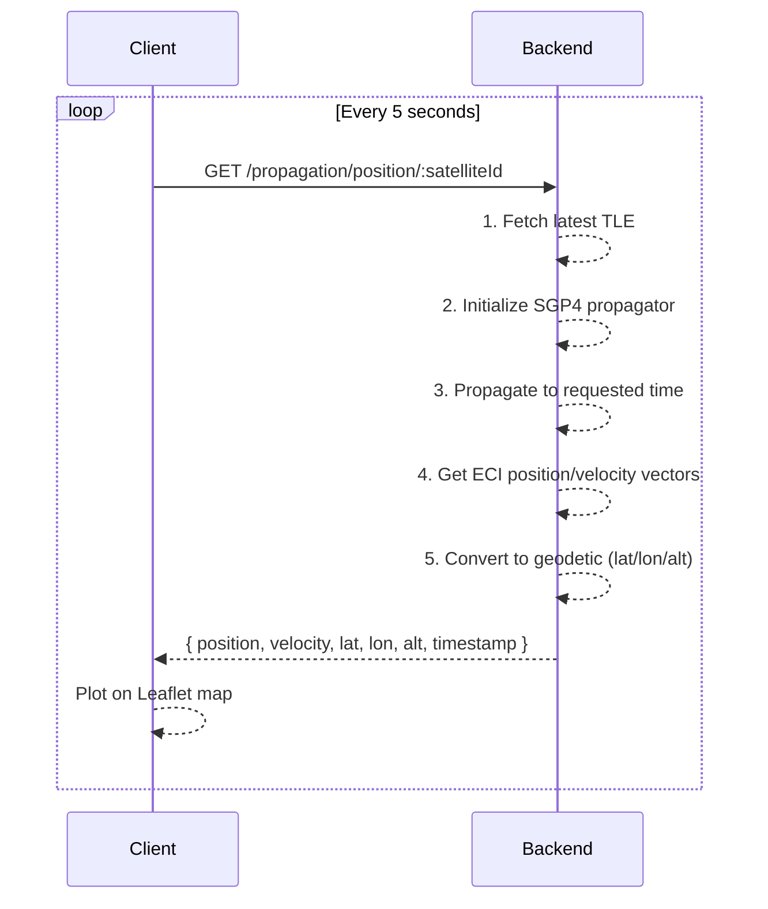

### Flyover Prediction

```
Client                          Backend
  |                               |
  |-- GET /propagation/          |
  |   flyover/:satelliteId       |
  |   ?lat=&lon=              -->|  1. Fetch latest TLE
  |                               |  2. Scan time window (step-based)
  |                               |  3. Calculate elevation at each step
  |                               |  4. Detect rise (>0) / peak / set (<0)
  |<-- {                         |
  |      rise_time, set_time,    |
  |      peak_elevation,         |
  |      duration                |
  |    } -----------------------|
```

<summary>Mermaid</summary>

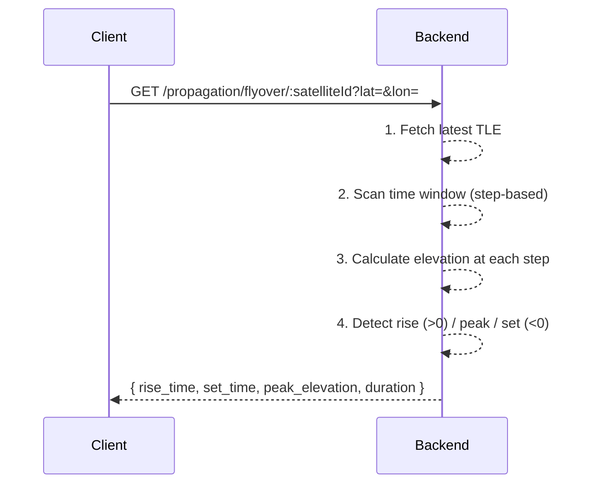

---

## Client-Side Pagination Architecture

Both Satellite and TLE tables use the same client-side pagination pattern:

```
URL Search Params
  |
  v
usePaginationParams(filterField)
  |-- reads: ?page=, ?pagesize=, ?sortBy=, ?{filterField}=
  |-- validates pageSize against [10, 20, 50, 100]
  |-- resets page to 1 on filter change
  |
  v
useSatellites() / useTles()
  |-- React Query: queryKey includes [filter, sortBy, page, pageSize]
  |-- prefetches page +1 and page -1
  |
  v
getSatellites() / getTles()
  |-- 1. Fetch ALL records from API (single request)
  |-- 2. applyFilter() -- field-specific logic
  |-- 3. applySort() -- generic field/direction comparator
  |-- 4. Slice for current page window
  |-- 5. Return { data, count, page, pageSize, totalPages }
  |
  v
Paginations component
  |-- prev / next buttons
  |-- numbered pages with ellipsis (usePagination hook)
  |-- page-size selector dropdown
  |-- writes back to URL search params
```

<summary>Mermaid</summary>

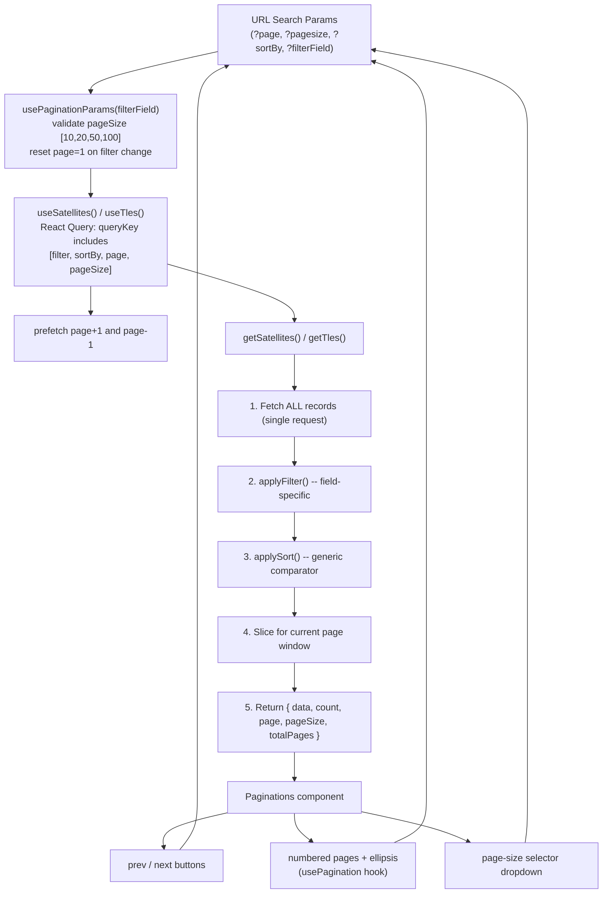

---

## API Endpoints

### Satellite (`/satellites`)

| Method | Path               | Description         |
| ------ | ------------------ | ------------------- |
| GET    | `/satellites`      | List all satellites |
| GET    | `/satellites/{id}` | Get satellite by ID |
| POST   | `/satellites`      | Create satellite    |
| PATCH  | `/satellites/{id}` | Update satellite    |
| DELETE | `/satellites/{id}` | Delete satellite    |

### TLE (`/tle`)

| Method | Path                            | Description                              |
| ------ | ------------------------------- | ---------------------------------------- |
| GET    | `/tle`                          | List all TLE records                     |
| GET    | `/tle/{id}`                     | Get TLE by ID                            |
| GET    | `/tle/satellite/{satellite_id}` | List TLEs for a satellite                |
| POST   | `/tle`                          | Create TLE (auto-parse orbital elements) |
| GET    | `/tle/compute/{satellite_id}`   | Compute TLE from satellite line data     |

### Propagation (`/propagation`)

| Method | Path                                   | Description                       |
| ------ | -------------------------------------- | --------------------------------- |
| GET    | `/propagation/position/{satellite_id}` | SGP4 propagation (ECI + geodetic) |
| GET    | `/propagation/flyover/{satellite_id}`  | Predict next flyover pass         |

### User (`/user`)

| Method | Path                      | Description                          |
| ------ | ------------------------- | ------------------------------------ |
| POST   | `/user/signup`            | Register + send verification email   |
| POST   | `/user/login`             | Login (returns JWT or MFA challenge) |
| POST   | `/user/verify_mfa`        | Verify TOTP code                     |
| GET    | `/user/me`                | Get current user profile             |
| POST   | `/user/logout`            | Blacklist JWT                        |
| GET    | `/user/verify`            | Email verification                   |
| GET    | `/user/send_reset`        | Send password reset email            |
| POST   | `/user/reset_password`    | Process password reset               |
| GET    | `/user/mfa_setup`         | Get MFA setup data                   |
| POST   | `/user/enable_mfa_verify` | Enable MFA                           |

### OAuth (`/oauth`)

| Method | Path              | Description                    |
| ------ | ----------------- | ------------------------------ |
| GET    | `/oauth/url`      | Get OAuth authorization URL    |
| GET    | `/oauth/callback` | OAuth callback (code exchange) |

---

## Database Schema

```
+---------------------+          +---------------------+
|     Satellite       |          |        TLE          |
+---------------------+          +---------------------+
| id (PK)             |<---------| id (PK)             |
| norad_id (unique)   |  1:N     | satellite_id (FK)   |
| name                |          | name                |
| category            |          | inclination         |
| line1               |          | raan                |
| line2               |          | eccentricity        |
| img                 |          | argument_of_perigee |
| date                |          | mean_anomaly        |
| is_active           |          | mean_motion         |
| created_at          |          | semi_major_axis     |
| updated_at          |          | period              |
+---------------------+          | age_days            |
                                 | created_at          |
+---------------------+          +---------------------+
|       User          |
+---------------------+          +---------------------+
| id (PK)             |          |      Setting        |
| username (unique)   |          +---------------------+
| email (unique)      |          | id (PK)             |
| password            |          | min_length          |
| email_verified      |          | max_length          |
| totp_secret         |          | min_payload         |
| mfa_enabled         |          | max_payload         |
| totp_verified       |          | price               |
| provider            |          | description         |
| provider_user_id    |          +---------------------+
| role                |
| avatar              |
| created_at          |
| updated_at          |
+---------------------+
```

<summary>Mermaid</summary>

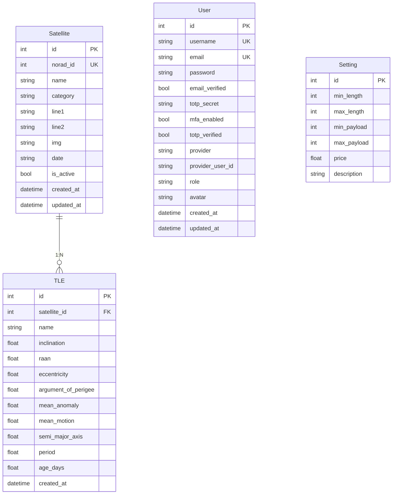

</details>

---

## Getting Started

### Prerequisites

- Node.js 18+
- Python 3.11+
- Redis server

### Frontend

```bash
npm install
npm run dev        # dev server on port 5174
npm run build      # production build
npm run preview    # preview production build
```

### Backend

```bash
cd backend
python -m venv venv
source venv/bin/activate    # Linux/macOS
pip install fastapi uvicorn sqlmodel aiosqlite httpx sgp4 pyjwt passlib pyotp \
            python-multipart fastapi-mail jinja2 qrcode itsdangerous pydantic-settings \
            scalar-fastapi redis
uvicorn app.main:app --reload --port 8000
```

### Environment Variables

Create `.env` at project root:

```env
VITE_API_BASE_URL=http://localhost:8000
```

Create `backend/.env`:

```env
APP_NAME=StellaOrbitTrack
SECRET_KEY=your-secret-key
JWT_SECRET=your-jwt-secret
JWT_ALGORITHM=HS256
MAIL_USERNAME=your-email
MAIL_PASSWORD=your-app-password
MAIL_FROM=your-email
MAIL_SERVER=smtp.gmail.com
MAIL_PORT=587
REDIS_HOST=localhost
REDIS_PORT=6379
CELESTRAK_BASE_URL=https://celestrak.org/NORAD/elements/gp.php
CELESTRAK_GROUP=active
CELESTRAK_FORMAT=3le
GITHUB_CLIENT_ID=your-github-client-id
GITHUB_CLIENT_SECRET=your-github-client-secret
GOOGLE_CLIENT_ID=your-google-client-id
GOOGLE_CLIENT_SECRET=your-google-client-secret
```

---

<!--
## Project Structure

```
Stella-Orbit-Track/
+-- backend/
|     +-- app/
|     |     +-- api/
|     |     |     +-- dependencies.py      # DI container
|     |     |     +-- router.py            # master router
|     |     |     +-- routers/
|     |     |           +-- satellite.py
|     |     |           +-- tle.py
|     |     |           +-- propagation.py
|     |     |           +-- user.py
|     |     |           +-- oauth.py
|     |     +-- core/
|     |     |     +-- security.py          # OAuth2 scheme
|     |     +-- database/
|     |     |     +-- models.py            # SQLModel entities
|     |     |     +-- session.py           # async engine
|     |     |     +-- redis.py             # JWT blacklist
|     |     +-- services/
|     |     |     +-- base.py              # generic CRUD
|     |     |     +-- satellite.py
|     |     |     +-- tle.py
|     |     |     +-- user.py
|     |     |     +-- mfa.py
|     |     |     +-- notification.py
|     |     |     +-- propagatecache.py
|     |     |     +-- oauth/
|     |     |           +-- base.py        # provider protocol
|     |     |           +-- github.py
|     |     |           +-- google.py
|     |     |           +-- registry.py
|     |     |           +-- oauth.py       # orchestrator
|     |     +-- worker/
|     |     |     +-- tasks.py             # async scheduler
|     |     +-- config.py                  # pydantic-settings
|     |     +-- schemas.py                 # Pydantic DTOs
|     |     +-- utils.py                   # JWT, URL-safe tokens
|     |     +-- main.py                    # FastAPI app
|     +-- templates/                       # email + MFA HTML
|     +-- tests/
+-- src/
|     +-- components/                      # reusable UI components
|     +-- features/
|     |     +-- authentication/            # login, signup, OAuth, MFA
|     |     +-- satellite/                 # CRUD + paginated table
|     |     +-- tle/                       # paginated table + detail
|     |     +-- dashboard/                 # charts + satellite cards
|     |     +-- settings/                  # app settings form
|     +-- hooks/                           # custom React hooks
|     +-- pages/                           # route-level components
|     +-- services/                        # API client layer
|     +-- ui/                              # shadcn/ui components
|     +-- utils/                           # constants, helpers
|     +-- styles/                          # global CSS
|     +-- App.jsx                          # router config
|     +-- main.jsx                         # React entry point
+-- index.html
+-- package.json
+-- vite.config.js
+-- tailwind.config.js
+-- tsconfig.json
``` -->

---

## SGP4 Algorithm Reference

This section documents the SGP4 (Simplified General Perturbations 4) algorithm and related orbital mechanics formulas used throughout the project.

### TLE Format

A Two-Line Element set encodes the satellite's orbital state. The project parses `line2` to extract six classical Keplerian elements plus mean motion:

```
Line 2 format:
2 NNNNN III.IIII RRR.RRRR EEEEEEE PPP.PPPP MMM.MMMM NN.NNNNNNNN RRRRR

Field          Column    Example       Description
----------------------------------------------------------------------
Line number    1         2             Always "2"
NORAD ID       3-7       25544         Catalog number
Inclination    9-16      51.6442       i (degrees)
RAAN           18-25     247.4627      Right Ascension of Ascending Node (degrees)
Eccentricity   27-33     0006703       e (decimal point assumed: 0.0006703)
Arg of Perigee 35-42     130.5360      omega (degrees)
Mean Anomaly   44-51     325.0288      M (degrees)
Mean Motion    53-63     15.72125391   n (revolutions/day)
```

### Keplerian Orbital Elements

Six parameters define an orbit uniquely:

| Element             | Symbol   | Description                                                  |
| ------------------- | -------- | ------------------------------------------------------------ |
| Semi-major axis     | $a$      | Size of the orbit ellipse (km)                               |
| Eccentricity        | $e$      | Shape of the orbit (0 = circle, 0-1 = ellipse)               |
| Inclination         | $i$      | Tilt of the orbital plane relative to the equator (deg)      |
| RAAN                | $\Omega$ | Where the orbit crosses the equatorial plane ascending (deg) |
| Argument of Perigee | $\omega$ | Orientation of the ellipse within the orbital plane (deg)    |
| Mean Anomaly        | $M$      | Position of the satellite along the orbit at epoch (deg)     |

```
                     Orbital Plane
                    /
          Vernal   /    omega (arg of perigee)
         Equinox  /    /
  ------*--------/----/--------> Equatorial Plane
                / i  /
               /    * Perigee
              /      \
             /        Satellite (at Mean Anomaly M)
            /
           / Omega (RAAN)
```

### Semi-Major Axis Derivation

The TLE provides mean motion $n$ (revolutions/day). The project derives semi-major axis using Kepler's Third Law.

**Step 1 -- Orbital Period**

$$T = \frac{86400}{n}$$

where $T$ is in seconds, $86400$ = seconds per day, $n$ = mean motion (rev/day).

**Step 2 -- Kepler's Third Law**

$$T^2 = \frac{4\pi^2}{GM} a^3$$

Solving for $a$:

$$a = \left( \frac{GM \cdot T^2}{4\pi^2} \right)^{1/3}$$

where $GM = \mu = 398600.4418 \text{ km}^3/\text{s}^2$ (Earth's gravitational parameter).

**Implementation** (from `TLEService._parse_line2`):

```python
GM = 398600.4418  # km^3/s^2
period = 86400 / mean_motion
semi_major_axis = (GM * period**2 / (4 * math.pi**2)) ** (1 / 3)
```

### Orbit Classification

The project classifies orbits by semi-major axis:

$$\text{altitude} = a - R_E \quad (R_E = 6371 \text{ km})$$

| Classification            | Altitude Range    | Semi-Major Axis          |
| ------------------------- | ----------------- | ------------------------ |
| LEO (Low Earth Orbit)     | $< 2000$ km       | $a < 8371$ km            |
| MEO (Medium Earth Orbit)  | $2000 - 35786$ km | $8371 \leq a < 42157$ km |
| GEO (Geostationary Orbit) | $\geq 35786$ km   | $a \geq 42157$ km        |

### SGP4 Propagation Model

SGP4 predicts satellite position at any time $t$ given a TLE epoch. It accounts for perturbations that pure Keplerian motion ignores.

**Input**: TLE line1 + line2 (parsed into a `Satrec` object via `sgp4` library)

**Output**: Position $\vec{r}$ and velocity $\vec{v}$ vectors in the TEME (True Equator, Mean Equinox) reference frame.

#### Core Flow

```
TLE (line1, line2)
  |
  v
Satrec.twoline2rv()        -- Parse TLE into internal model
  |
  v
Compute Julian Date        -- jday(year, month, day, hour, min, sec)
  |                            JD = 367*y - INT(7*(y+INT((m+9)/12))/4)
  |                                + INT(275*m/9) + d + 1721013.5
  |                                + ((s/60+min)/60+h)/24
  v
sat.sgp4(jd, fr)           -- Propagate to target time
  |
  |  Internally performs:
  |  1. Secular perturbations (drag, J2, J3, J4)
  |  2. Long-period periodics
  |  3. Short-period periodics
  |  4. Position & velocity in TEME frame
  |
  v
(error, r, v)
  r = (x, y, z) km         -- ECI position
  v = (vx, vy, vz) km/s    -- ECI velocity
```

#### Perturbation Model

SGP4 accounts for these forces beyond ideal two-body motion:

| Perturbation             | Source                  | Effect                                  |
| ------------------------ | ----------------------- | --------------------------------------- |
| $J_2$ (Earth oblateness) | Equatorial bulge        | Nodal regression, apsidal precession    |
| $J_3$                    | North-south asymmetry   | Orbit plane tilt correction             |
| $J_4$                    | Higher-order oblateness | Refinement of $J_2$ effect              |
| Atmospheric drag         | $B^*$ term in TLE line1 | Orbital decay, semi-major axis decrease |
| Deep-space (SDP4)        | Lunar/solar gravity     | Activated for period $> 225$ min        |

The $B^*$ drag term from TLE line1 models atmospheric drag:

$$\dot{a} \propto -B^* \cdot \rho \cdot v$$

where $\rho$ is atmospheric density and $v$ is orbital velocity.

#### Secular Rates (J2-Driven)

The dominant perturbation is Earth's $J_2$ oblateness ($J_2 = 1.08263 \times 10^{-3}$).

**Nodal regression** (RAAN drift):

$$\dot{\Omega} = -\frac{3}{2} \frac{n J_2 R_E^2}{a^2 (1 - e^2)^2} \cos i$$

**Apsidal precession** (argument of perigee drift):

$$\dot{\omega} = \frac{3}{2} \frac{n J_2 R_E^2}{a^2 (1 - e^2)^2} \left( 2 - \frac{5}{2} \sin^2 i \right)$$

**Mean motion secular change**:

$$\dot{M}_{\text{secular}} = n + \frac{3}{2} \frac{n J_2 R_E^2}{a^2 (1 - e^2)^{3/2}} \left( 1 - \frac{3}{2} \sin^2 i \right)$$

### ECI to Geodetic Conversion

After SGP4 outputs ECI position $(x, y, z)$ in TEME frame, the project converts to geographic coordinates.

**Implementation** (from `PropagationService.eci_to_geodetic`):

**Longitude**:

$$\lambda = \arctan2(y, x)$$

**Geocentric Latitude** (spherical approximation):

$$\phi = \arctan2\!\left(z, \sqrt{x^2 + y^2}\right)$$

**Altitude** (spherical Earth):

$$h = \sqrt{x^2 + y^2 + z^2} - R_E$$

where $R_E = 6371$ km.

> Note: This is a spherical approximation. A more precise implementation would use the WGS-84 ellipsoid with iterative latitude correction:
>
> $$\phi = \arctan\!\left(\frac{z + e'^2 b \sin^3\!\theta}{\sqrt{x^2+y^2} - e^2 a_e \cos^3\!\theta}\right)$$
>
> where $a_e = 6378.137$ km (equatorial radius), $b = 6356.752$ km (polar radius), $e^2 = 1 - b^2/a_e^2$.

### Flyover Prediction

The project predicts when a satellite passes over an observer's location by scanning discrete time steps.

**Elevation angle** of satellite as seen from observer at $(\phi_o, \lambda_o)$:

$$\alpha = \arcsin\!\left(\sin\phi_s \sin\phi_o + \cos\phi_s \cos\phi_o \cos(\lambda_s - \lambda_o)\right)$$

where $(\phi_s, \lambda_s)$ = sub-satellite point (geocentric lat/lon).

**Algorithm**:

```
for each time step t in [start, start + duration]:
    propagate satellite to t -> (x, y, z)
    convert to (lat_s, lon_s)
    compute elevation angle alpha

    if alpha > 0 and no rise recorded:
        rise_time = t
    if alpha > max_elevation:
        max_elevation = alpha
        peak_time = t
    if rise recorded and alpha < 0:
        set_time = t
        break

return { rise_time, peak_time, set_time, max_elevation }
```

Default parameters: `duration_minutes=1440` (24h scan), `step_seconds=30`.

<details>
<summary>Mermaid -- SGP4 Propagation Pipeline</summary>

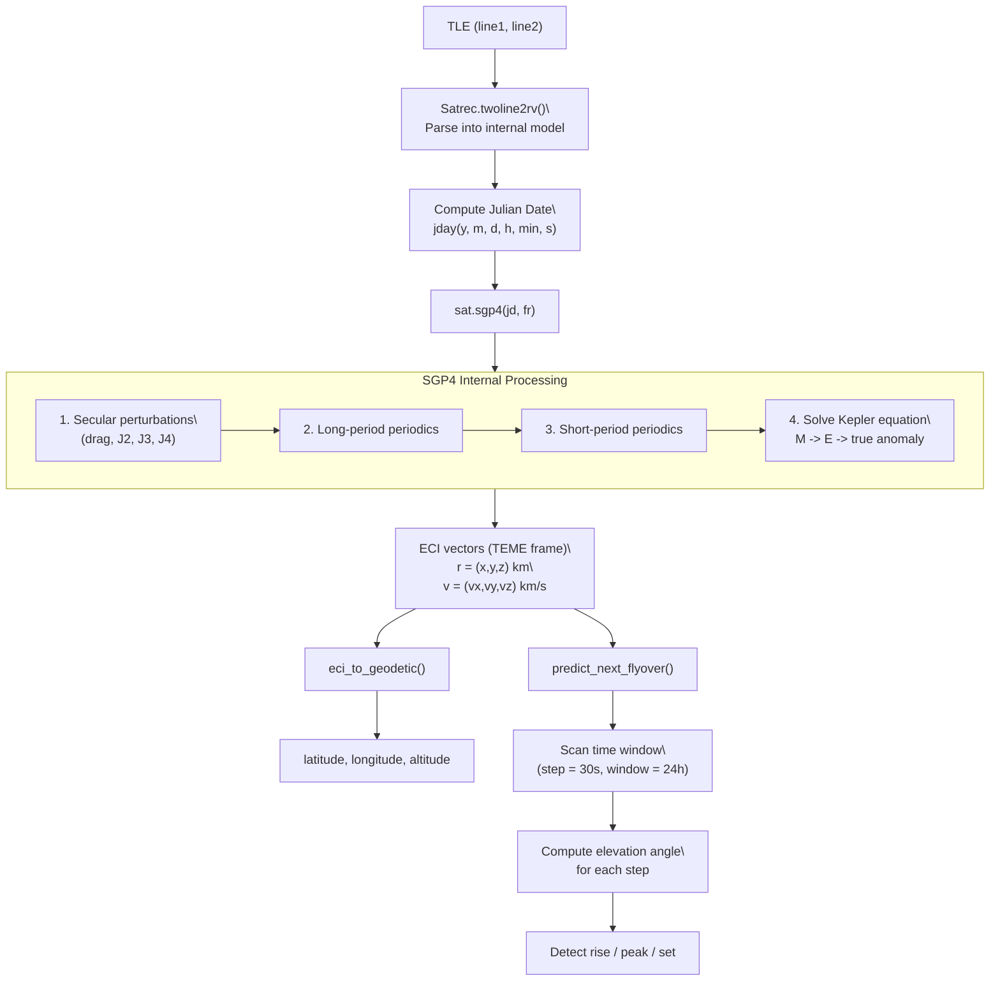

</details>

<details>
<summary>Mermaid -- Kepler's Third Law Derivation</summary>

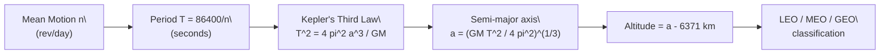

</details>
